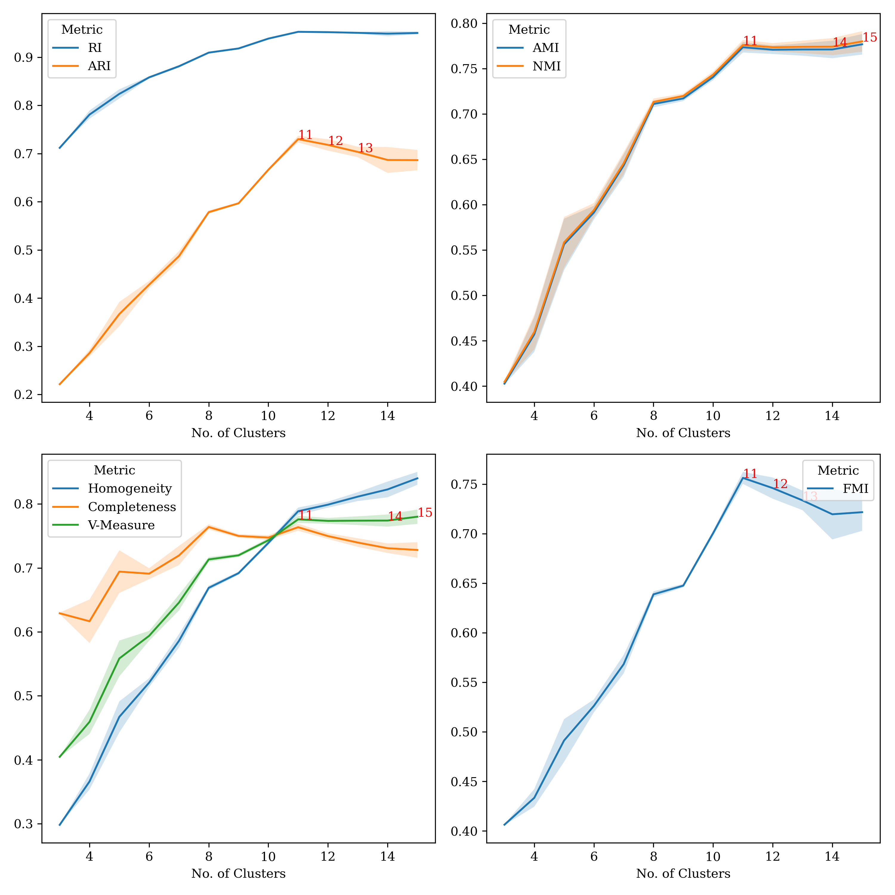
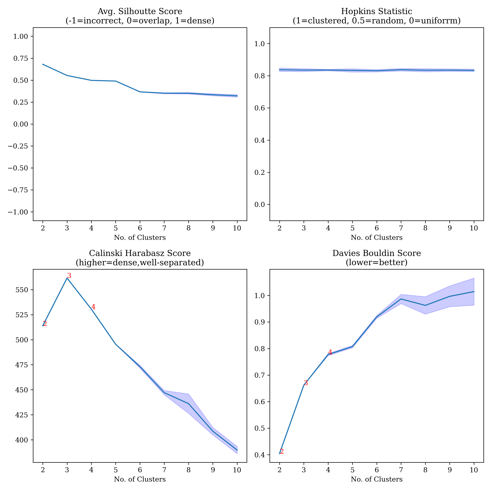
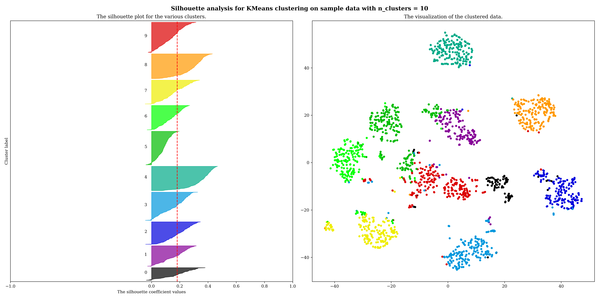

# Clustering Utilities

This packages provides a simple convenience wrapper around some basic sklearn utilities for clustering. The only function available is `eval_clustering()`.

## Installation
`pip install clustutils4r`

## Available Parameters

`model`: Clustering model object (untrained)

`X`: Numpy array containing preprocessed, normalized, complete dataset features

`gt_labels`: Numpy array containing encoded ground-truth labels for `X` (often not available)

`num_clusters`: Range of no. of clusters to grid search over.

`num_runs`: No. of runs per no. of cluster (defaults = 10).

`make_metrics_plots`: Plot various clustering evaluation metrics. Depending on whether `gt_labels` are provided, you will get one or more plots - one for non-ground truth-based metrics and another for ground truth-based metrics. (default = `True`).

`annotate_topN_best_scores`: Whether to annotate top N score in metrics plots (defined by `annotN`) (defaults = `True`).

`annotN`: No. of top scores to annotated in metrics plots (defaults = 3).

`make_silhoutte_plots`: Whether to make silhouette plots for each `num_clusters` value (default = `False`).

`embed_data_in_2d`: Whether to compute TSNE embeddings of the `X` to plotted alongside silhouette plot or plot the first 2 features (default = `False`).

`RESULTS_DIR`: location to store results; directory will be created if it does not exist

`save`: set True if you want to save all results in RESULTS_DIR; defaults to False

`show`: display all results; useful in notebooks; defaults to False

## Example Usage
```python
import os
from sklearn import datasets

# Load the iris dataset
data = datasets.load_digits()

# Split the data into features and labels
X = data.data
y = data.target

# Define clustering model
from sklearn.cluster import KMeans
kmeans_model = KMeans()

# Run the evaluation
from clustutils4r.eval_clustering import eval_clustering
range_clusters = list(range(3,15+1))
labelled_datapoints, nongt_metrics, gt_metrics \
    = eval_clustering(X=X, gt_labels=y,
                        model=KMeans(),
                        num_clusters=range_clusters, num_runs=10,
                        annotate_topN_best_scores=True, annotN=3,
                        make_metrics_plots=True,
                        make_silhoutte_plots=True, embed_data_in_2d=True,
                        show=True, 
                        save=True, RESULTS_DIR=os.getcwd()+'/results',
                    )

```
<!-- ### GT Metrics-->

<!--  -->

<!-- ### Non GT Metrics -->

<!--  -->

<!-- ### Sil Plots -->

<!--  -->